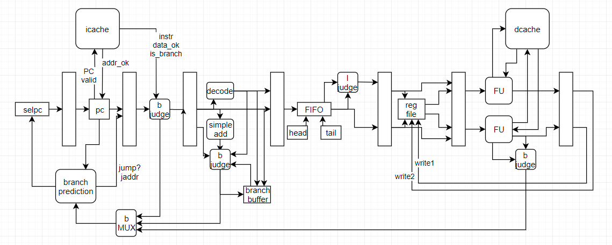
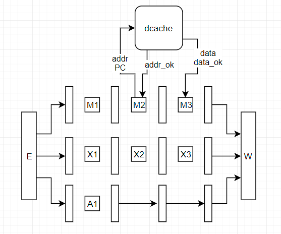

## CPU设计

> 2021/7/22
>
> 此文档是我们小组的处理器实际采用的架构

### CPU架构

与Cache的交互只在取指和访存两个阶段。一下每个阶段都对应**时钟一个周期**

1. 取指（1）：将计算好的PC发给ICache
2. 取指（2）：获取ICache中的指令组和其它信息
3. 译码：对指令进行译码，并对分支指令的地址进行计算
4. 发射：往队列尾部插入指令组，在头部根据控制逻辑发射一条或两条指令
5. 数据获取：通过寄存器堆和数据旁路获取数据
6. 执行：在`FU`中计算数据
7. 访存（1）：在`FU`中向DCache发送访存请求，延迟取数据
8. 访存（2）：在`FU`获取DCache中的数据或其它信息，延迟计算
9. 退休：将数据写回到寄存器堆

### 指令数据传输

- ICache传来的指令组要8字节对齐，也就是包含两条指令
- 接收到指令时，需要根据PC值来判断第一条指令是否有效，如果PC值只是4字节对齐而没有8字节对齐（如`bfc00004`），那么此时指令组第一条指令应该判定为无效
- 当分支指令为8字节指令组的前四个字节的话（一条指令4个字节），此时延迟槽正好为后四个字节，不会出现问题，所以该指令组的分支预测正常进行
- 当分支指令为指令组后四个字节的话，需要在下个周期把延迟槽取出来，也就是说该分支指令没有预测的必要，始终是顺序取，等到后面的延迟槽来了才应该真正开始分支预测
- 综上，我们发现，分支预测应该是在延迟槽取来的那个周期进行，而不是分支指令本身取来的那个周期！！！
- 但是延迟槽本身没有跳转的地址这样的信息，需要上个周期的分支指令的信息，因此需要在decode阶段放置一个BB（Branch Buffer）来存储上个周期的分支指令的信息，在当前周期处理延迟槽的同时利用这个信息进行分支预测的正确性判断

#### 取指

第一个阶段发送第二个阶段接收的原因：让CPU流水线阶段与ICache的流水线阶段**匹配**，这样可以提高吞吐量，如果在同一个阶段发送并接收的话，CPU流水线就必须暂停，降低了效率。

- 取指分为两个阶段，第一个阶段向ICache发送地址，在第二个阶段接受指令，因为指令传来需要一定时间，所以只对传来的指令进行简单的处理和判断。
- 第一个阶段发送的数据：指令地址PC、地址有效位`valid`
- 以ICache返回的 `addr_ok` 作为是否接受到的标志，若未接收到，需继续发送数据，也就是把当前周期给stall（暂停）住，这个是用流水线控制逻辑实现的。
- 根据当前的PC值，预测下一个PC值，并把是否是跳转指令、预测的分支指令类型、是否预测跳转以及跳转的地址传给后续的阶段来判断分支预测的正确性，以更新分支预测模块。
- 第二个阶段传来的数据：指令组中的指令（两条）、指令组的有效位 `data_ok`、指令是否是分支指令`is_branch`（两位、需要ICache预解码）
- ==同时当第二个阶段没有传来`data_ok`的话，且第二个阶段是有指令在等待请求返回的，也就是流水线寄存器中的`valid`为1（表明该阶段是有效的，而非`nop`之类的无效指令），此时需要stall住第二阶段来等待数据返回，由于第二阶段stall住了，所以如果第一阶段也是有效的地址请求即`valid`为1，此时也要跟着stall住。==
- ==返回的指令组8字节对齐，包含两条指令，若PC请求仅为4字节对齐而不是8字节对齐，此时指令组第一条指令为无效指令，因为PC应该是从第二条指令开始取。==

#### 译码

- 判断指令的类型，以及源寄存器和目的寄存器的下标，放入到发射队列中
- 若分支指令取来了，但是延迟槽没有取来，则把分支指令的信息传给BB，等到延迟槽来的时候，把BB保存的分支指令的信息传给延迟槽。

#### 发射

- 两个写端口、两个读端口的FIFO的双发循环队列，用head和tail下标的方式模拟循环队列。
- 存放的数据：指令的地址、指令的各类操作数、是否为访存指令、是否为特权指令、是否为分支指令、是否预测跳转、预测跳转的地址
- 以下不能同时发射两条指令的情况：
- 两条连续的除法指令：只有一个除法器（因为有两个乘法器，所以可以同时发射两条乘法指令，不过乘法器最好流水化）
- 访存指令：只有一个访存单元，而且DCache只有一个读写端口，没法同时处理两条访存指令
- `CP0`、`TLB`等特权指令
- 两条指令有数据相关：注意0号寄存器的假相关性（0号寄存器一直为零）
- 分支指令和延迟槽必须一起发射，当第二条为分支指令或延迟槽还未取到发射队列的时候。

#### 数据获取

- 用两条指令的源寄存器下标获取源寄存器里的值，同时进行旁路（转发）从而获得所有的操作数，因为可能会有延迟读操作，所以当前周期读到的可能无效，同时对于不可避免的指令相关需要暂停流水线。
- 寄存器堆有四个读端口、两个写端口

#### 执行和访存阶段

一个`FU`包含执行一个阶段和访存两个阶段，总共三个阶段，其中访存指令需要三个周期，第一个周期计算访存地址，第二个周期发送请求，第三个周期接收请求；乘法指令也需要三个周期；一般的计算指令只需要一个周期。方便起见，这里我们把`FU`中的第一个阶段称为执行阶段，后两个阶段称为访存阶段，而实际上乘法指令的三个阶段都可以算作是执行阶段，普通计算指令只有第一个执行周期，后两个周期用作**延迟计算**

#### 执行

- 获得可能的转发数据，生成指令的结果，计算访存地址
- 对于需要延迟执行的指令，这个周期可以不管。
- 对于分支指令，这里可以最终判断是否跳转以及跳转的地址，更新分支预测模块。
- 多周期指令会暂停流水线

#### 访存

> 若访存后紧跟需要访存数据的指令，即访存相关，则需要暂停流水线很多个周期，为了提高效率，处理包括访存相关在内的各种指令相关，减少流水线暂停的周期，进行部分指令的延迟执行。如果指令在译码阶段后不会产生异常（例如 AND，XOR，ADDU 等），我们可以将这类指令的操作数读取放到到访存的第一阶段执行，执行放到访存的第二阶段。这样访存相关的暂停最短只要一个周期。我们还可以将分支指令也如此推迟。但是由于分支有可能预测失败，我们需要能够撤销其后的指令，若在访存第二阶段处理分支指令时发现分支预测失败，需要把这个信息传给DCache，防止改变DCache。
>
> 当然，如果指令不能延迟执行，那么仍然需要暂停到操作数均可用为止。此时的指令相关不仅要考虑访存指令，还要考虑正在延迟执行的指令。
>
> 在执行阶段计算结果。如果指令之间存在访存相关，并且指令是分支或者不会在执行阶段出现异常，那么其可以在流水线访存第一阶段读取操作数，在后一个阶段计算结果。

- 访存有两个阶段对应于`FU`的第二和第三阶段，与取指的两个阶段类似
- 访存第一阶段会发送的数据：地址有效位、是否为写请求、四位字节写使能、读写的地址、写入的数据
- 访存第一阶段以 `Dache` 返回的 `addr_ok` 作为成功接收的标志
- 第一阶段还会处理异常，并进行部分指令的延迟取数据
- 访存第二阶段接受的信号：有效位 `data_ok` 和数据，其中`data_ok`作为成功完成当前访存的信号
- 第二阶段还会进行部分指令的延迟计算

#### 退休

- 将数据写回到寄存器堆中

 

### 分支预测架构

> 主流的处理器都是基于两位的饱和计数器来实现的，采用！
>
> 经测试，PHT为2KB时，即PC值中用来寻址PHT的位数为13位，此时分支预测准确率达到了93%，采用！
>
> MIPS 74kf 处理器：不进行目标地址的预测，而是在取指阶段根据ICache预解码的分支指令的信息直接计算目标地址，因为MIPS程序的绝大部分分支指令是直接跳转指令，可以很快算出目标地址。
>
> MIPS处理器中用`JAL`、`BAL`等指令作为CALL指令，用`jr ra`作为Return指令

#### 预测

- 部件有BIT、PHT、BTB、RAS，下述的`PC`索引位**仅为示例**，具体实现请参数化（~~方便挤牙膏~~）
- BIT：在取指第一阶段根据当前的`PC[13:2]`索引，内容有两位（是否是分支指令、是否是函数返回，即`jr ra`）
- PHT：在取指第一阶段根据当前的`PC[13:4]`索引，内容为两位饱和计数器（00：强不跳转，01：弱不跳转，10：弱跳转，11：强跳转）
- BTB：在取指第一阶段根据`PC[13:4]`索引，内容为32位的跳转的地址
- 同一条分支指令它的PHT和BTB是一一对应的。
- RAS：在取指第一阶段获取栈顶数据，根据BIT中的一位信息（是否是函数返回）来使用，但是暂时不更新栈（因为有可能BIT中的信息是错的），在解码阶段（能够确保正确的情况下）根据指令的类型（call：`jal` `bal`、return：`jr ra`）把地址进行压栈或出栈，栈中每一项带有计数器（当压栈时，把栈顶和需要压栈的地址比较，相同就让计数器加一，栈指针不动，出栈时计数器减一，减到零才真正让栈指针往下一格）

#### 正确性判断和更新
分支预测可能出现的问题：

| 编号 | 具体表述                   |
| ---- | -------------------------- |
| 1    | 未能正确判断是否是分支指令 |
| 2    | 是否跳转预测错误           |
| 3    | 跳转地址预测错误           |
| 4    | 未能正确判断是否是函数返回 |

- 取指第二阶段根据ICache传来的预解码的是否是分支指令的信息`is_branch`能够判断编号为1的错误
- 解码阶段根据分支指令类型能够判断编号2、4（部分分支指令一定跳转），根据简单加法器算出的地址能够判断编号3，根据RAS的地址能够判断编号3，同时更新RAS。
- 执行阶段根据得到的结果能够完全判断编号2和3
- 在预测错误时需要立刻重新取指，而上述部件的更新或者写入在执行阶段统一处理（除了RAS在解码阶段更新）

 

### 延迟执行

- 部分计算指令：AND、OR、ADDU
- 可以延迟执行的指令：在解码阶段之后不会出现异常的指令，

| 可能出现异常的指令 | 延迟执行的原因 |
| ------------------ | -------------- |
|                    |                |
|                    |                |
|                    |                |

- 什么时候需要延迟执行：当在读操作数的时候，指令操作数没有完全准备好，且此时指令允许延迟执行，需要在写入计分板的时候带上额外一位（允许）

 

### 数据旁路

当指令进入`FU`的时候将信息写入计分板

- 计分板：一共31行，每一行包含的是对应寄存器的状态（一共32个寄存器，但是不包括0号寄存器）
- 计分板中包含的信息位：pending（寄存器有效位，即寄存器是否是`FU`中某些的指令的目的寄存器）、指令类型（访存、计算、乘法）、在FU中的周期（每个周期自增）、判断其是否会延迟执行

 

### 权衡与选择

1. store指令需要返回`data_ok`吗？目前`dcache`对标`icache`，所以是需要返回`data_ok`
2. BIT（Branch Instruction Table）部件的选择：看过各种资料，分支预测这块的架构中好像都没有BIT这个部件，也就是直接判断一条指令是否是分支指令的部件。我们知道，分支预测是按照当前PC去预测下一个PC值，而且因为有大小的限制，不可能用PC的所有的位来索引，一定会有冲突，即不同的PC索引到同一个地方，而如果分支指令对应的PC和非分支指令对应的PC索引到同一个地方产生冲突的话，即每次非分支指令都会用到分支指令的预测结果，如果没有办法把它们区分开来，就会造成非分支指令，但是却预测跳转的错误。一般架构中好像是用BTB中tag比对后出现的miss（非分支指令一定会miss，所以只能顺序取，所以不会出现跳转的错误）来被动区分非分支指令和分支指令，这里我们打算主动区分，因为每个PC值只需要存放一位是否是分支指令的信息，所以可以存放很多。同时还可以存放分支指令类型的信息。
3. 分支与非分支指令的区分？主动：BIT，需要的空间多。被动：在BTB中利用tag比对会出现的miss，时间花费多
4. 取指时分支指令与延迟槽怎么处理？（1）ICache给的指令组中分支和延迟槽绑定，问题：分支和延迟槽不在同一个cache line（2）译码阶段若发现没有取到分支指令后的延迟槽，把分支的信息放在一个缓存中，等到下一周期取来了延迟槽再进行分支预测和正确性判断。目前我们采取的是方法（2）
5. 发射阶段若第二条是分支指令则不发射的原因：当分支预测失败后需要清空之前的指令，如果延迟槽慢分支指令一个周期的话，则延迟槽需要执行，而和延迟槽同周期发射的另一条指令则不需要执行，但他们是在同一个周期发射的，处理起来比较麻烦。
6. 针对分支指令（就是拿分支指令的PC来）进行分支预测：（1）因为一个指令组最多只有一条分支指令，所以不会出现需要多次预测的情况，可以直接用指令组对应的PC值（8字节对齐）来预测（2）虽然有可能不执行分支指令，而是直接执行分支指令后一条指令（即延迟槽）：比如说有一条分支指令跳转到延迟槽，这样用分支预测就不正确了，一个解决方法是存放指令组中分支指令的具体位置，但是可能性比较小，所以不进行特殊处理。

